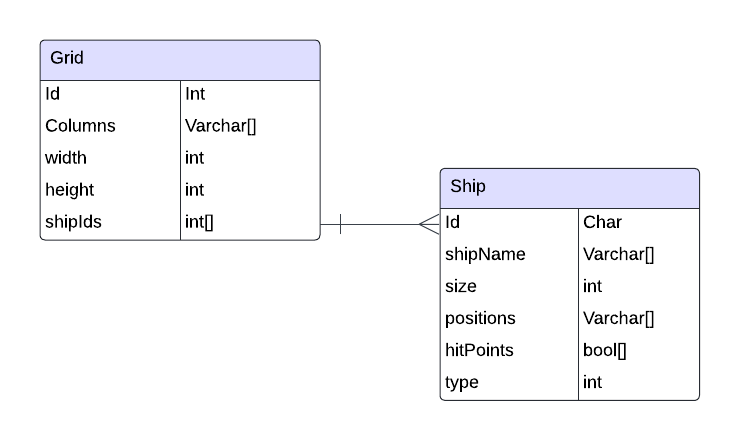

# Battleship

This is a backend API made in .NET that allows users to play Battleship.

## Project Members
- Isaac Hessel-Robinson

## Project Requirements
- README that describes the application and its functionalities
- ERD of your DB
- The application should be ASP.NET Core application
- The application should build and run
- The application should have unit tests and at least 20% coverage (at least 5 unit tests that tests 5 different methods/functionality of your code)
- The application should communicate via HTTP(s) (Must have POST, GET, DELETE)
- The application should be RESTful API
- The application should persist data to a SQL Server DB
- The application should communicate to DB via EF Core (Entity Framework Core)

## Tech Stack

- React/JS (Front End)
- C# (Back End Programming Language)
- SQL Server (Azure Hosted)
- EF Core (ORM Tech)
- ASP.NET (Web API Framework)
- HTML, CSS
    - Bootstrap? Tailwind? 

## Tables

## User Stories
- As a player, I want the AI to set up its ships in a way that complies with game rules so that I have targets to find
- As a player, I want to be able to view the grid & understand the status of each square so that I can make informed decisions
- As a player, I want to be able to shoot at a specific square & know the result so that I can feel engaged in the play flow
- As a player, I want the game to prevent me from making invalid shots so that I don't waste any actions
- As a player, I want positive feedback when I win the game so that I feel like I've achieved something
- As a player, I want to be able to save & load gamestates so that I can play over multiple sessions 

## Stretch Goals
- As a player, I want to be able to set up ships on my own grid so that I can participate in both sides of the Battleship game
- As a player, I want the AI to shoot at my ships to provide tension about whether I'll win
- As a player, I want the AI to make rational choices about shooting to provice an exciting challenge
- As a player, I want to recieve feedback if I lose to make winning feel more rewarding